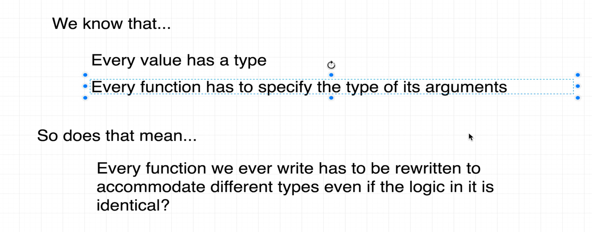
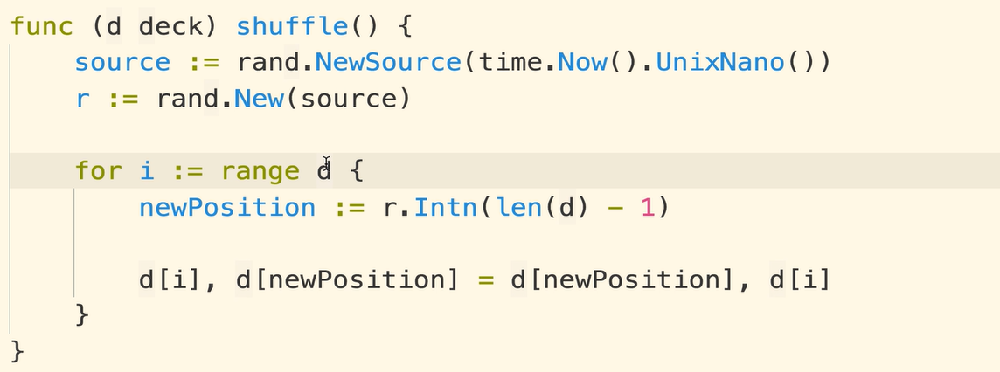
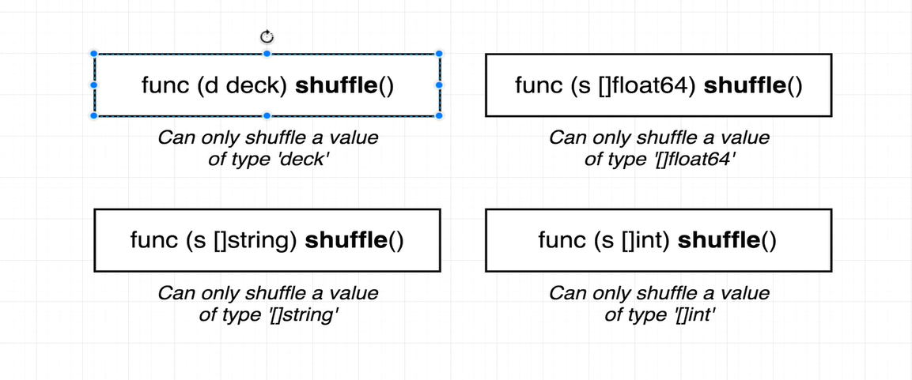
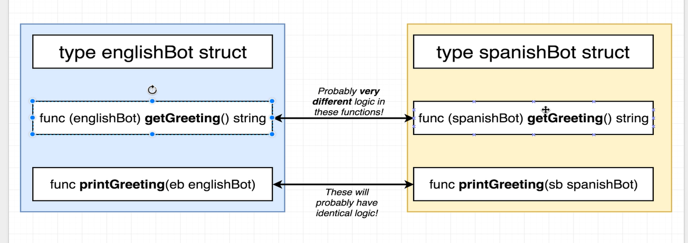
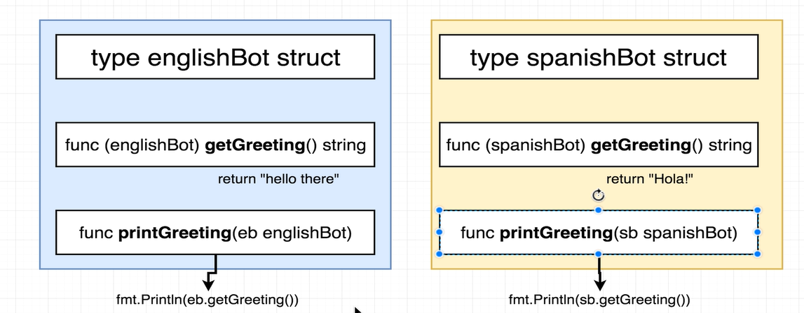
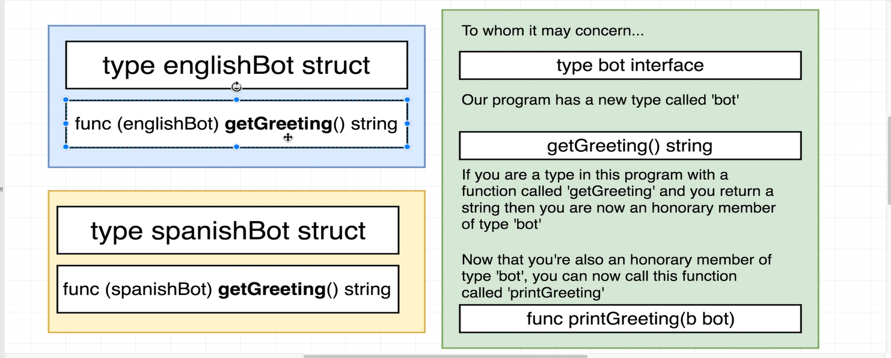
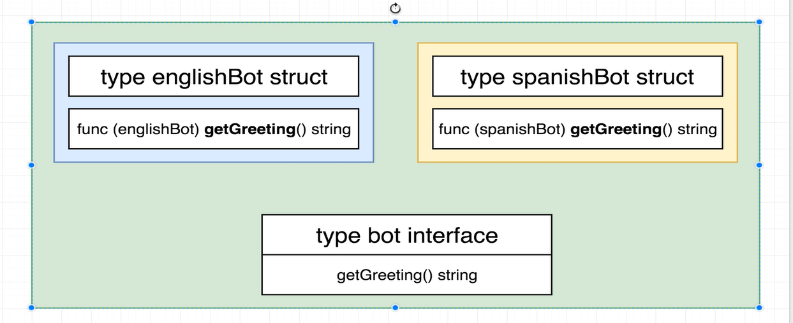
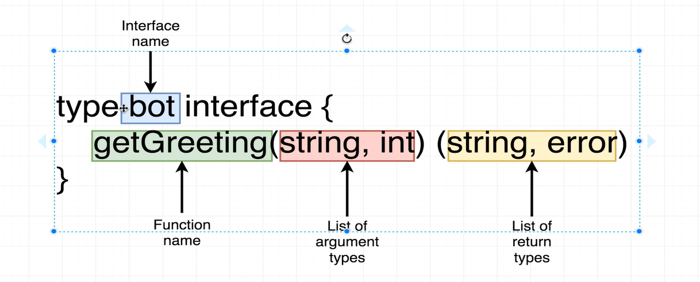
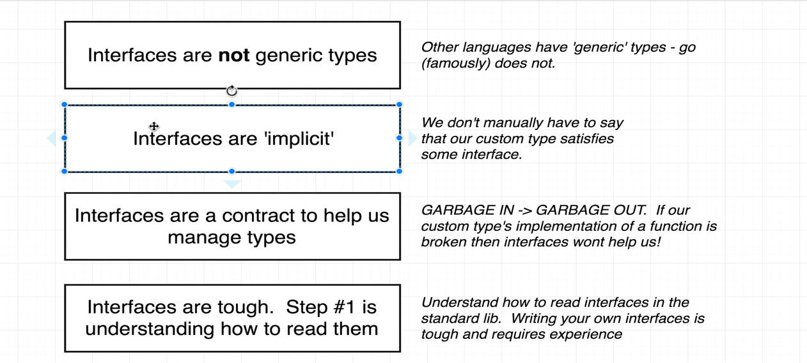

The above issue should be ideally solved with - https://go.dev/doc/tutorial/generics
But here we will use interfaces to solve it (Generics were introduced recently)

Updated:- The above shuffle should actuall be solved with interfaces only since it is not receiving any values as input and is acting as a method available on type so solving it with interface is a proper method.

Generics are now introduced & in go the interfaces are implicit i.e. we don't declare or write anything that links the concrete types with the interface types! This is both useful (less code) and bad (not readable and explicit to understand)