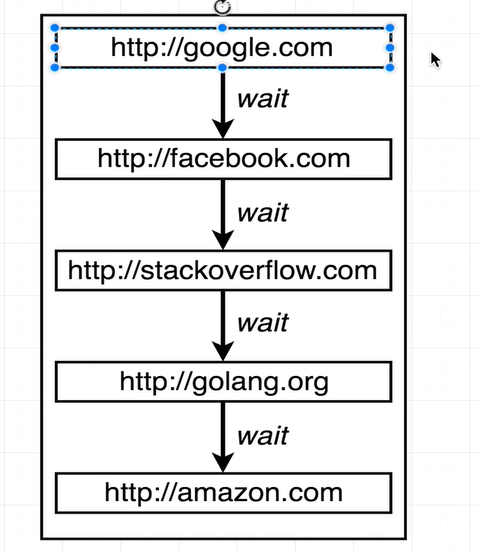

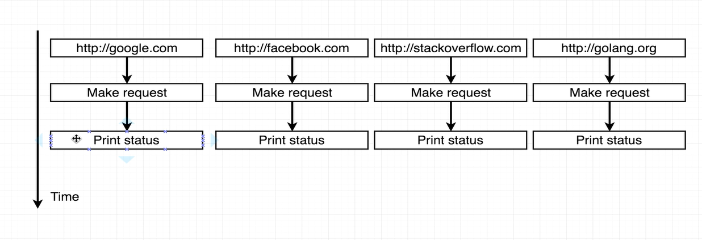

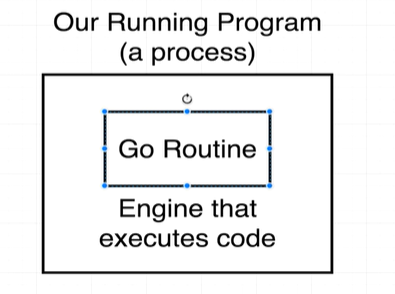

When we launch a go program it executes in a Go Routine. So your main go routine is responsible to run all the lines of code one by one.

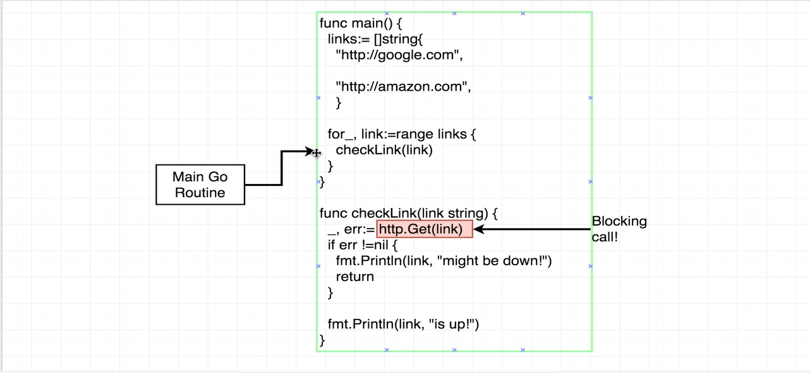

We can create multiple go routines and execute some part of the code in a separate go routine.

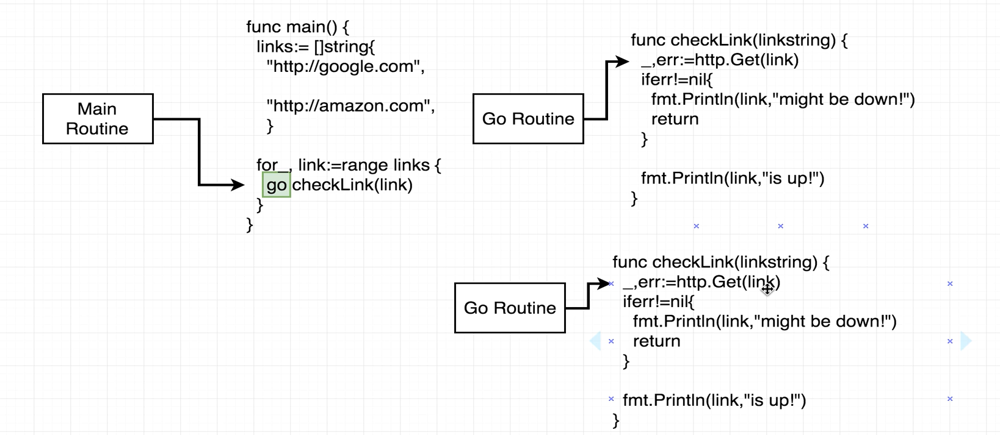

In the above pic we can see that checkLink is called in a new go routine by writing a keyword go.

The code flow is something like, 

main go routine is started it reaches the for loop and sees that checkLink needs to be called in new go routine so a new go routine is launched and as soon as it reaches the http.Get function which is a blocking function the program goes back to main routine to see if something else can be done and then the for loop spawns a new checkLink for new link and this also works the same way till all the links are being checked in separate go routines.

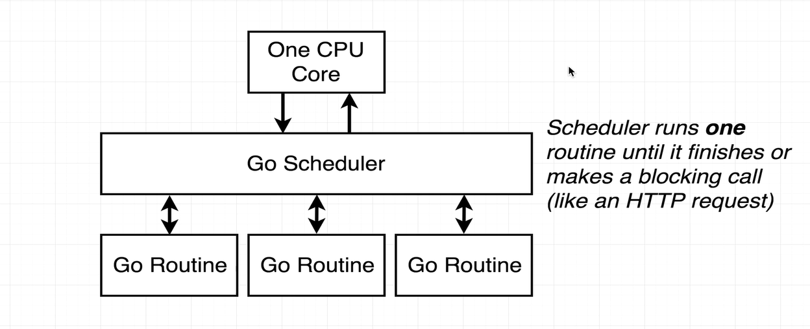

ONLY ONE GO ROUTINE IS RUNNING AT ANY GIVEN POINT OF TIME.

If we have more CPUs then the scene is a bit different,

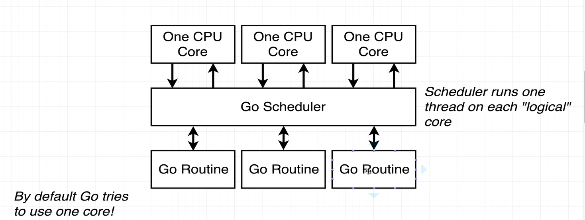

Each CPU will manage one go routine.

Conncurency vs parallelism

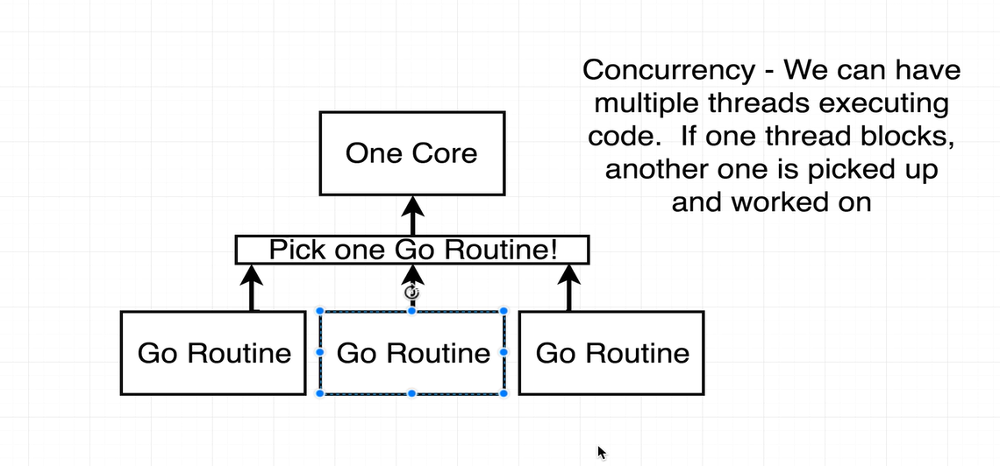

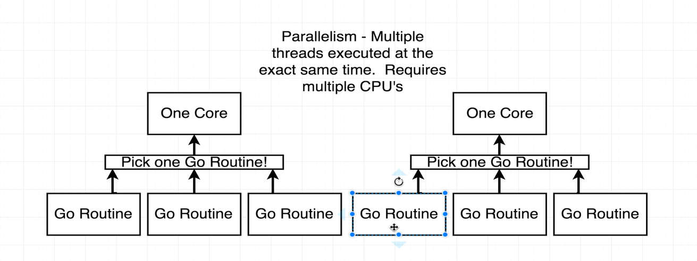

Main vs child routine

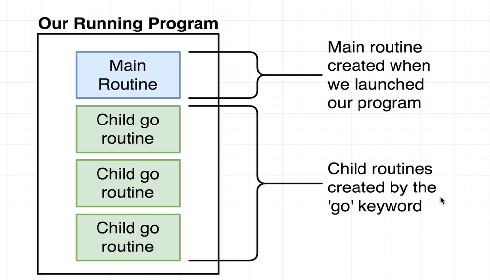

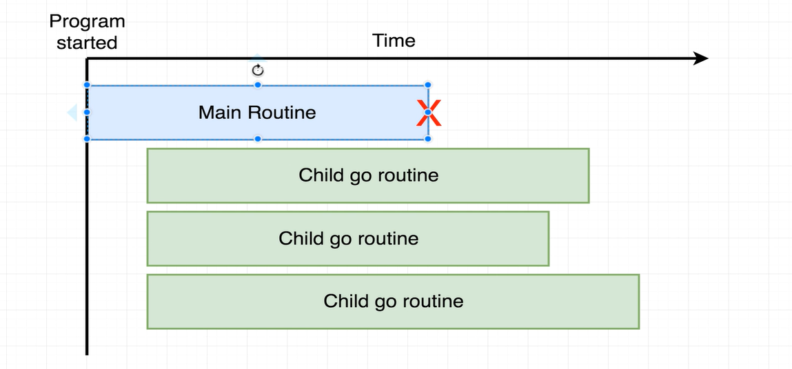

We need to make sure main routine waits still all child routines are completed.

go routines & channels are both structures in go for managing concurrency.

Channel is used to communicate between go routines.

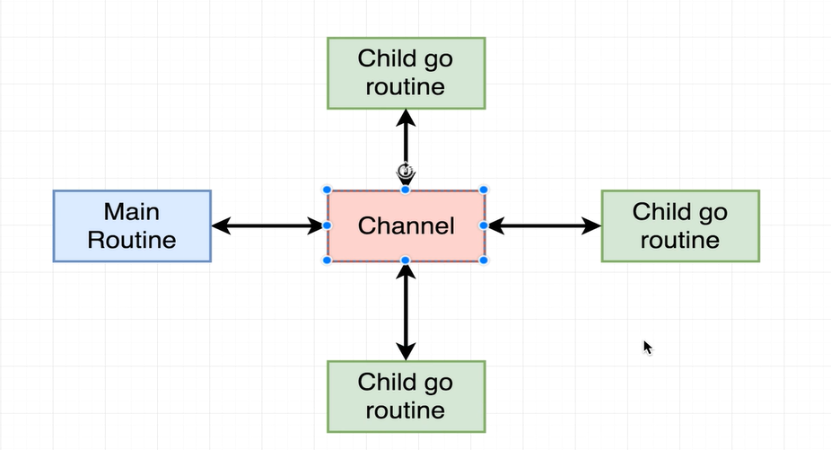

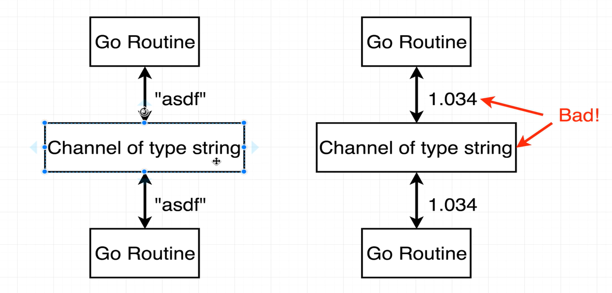

channels need to have the type associated to indicate kind of data/message that will be shared.

Sending data using channels
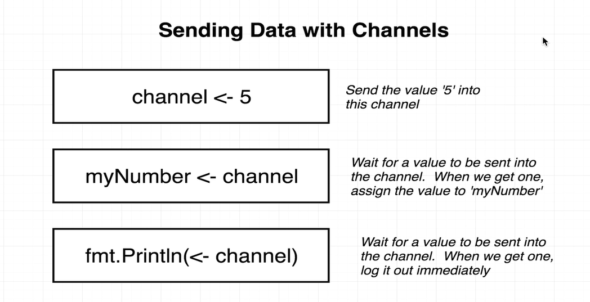

In above pic first box says we are sending 5 into the channel. The second box indicates that we are reading value from channel.

Thrird box indicates we need not store the value we can just print it diretly.

Reading data from the channel is a blocking statement and code proceeds when a value is read from the channel.

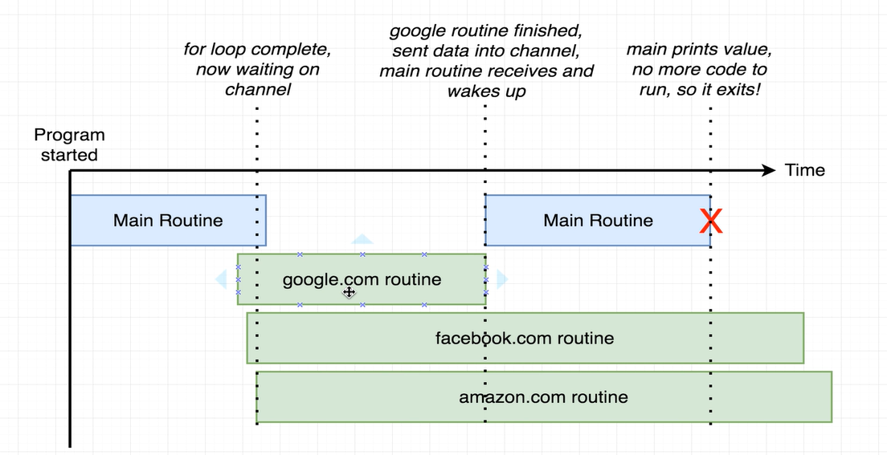
